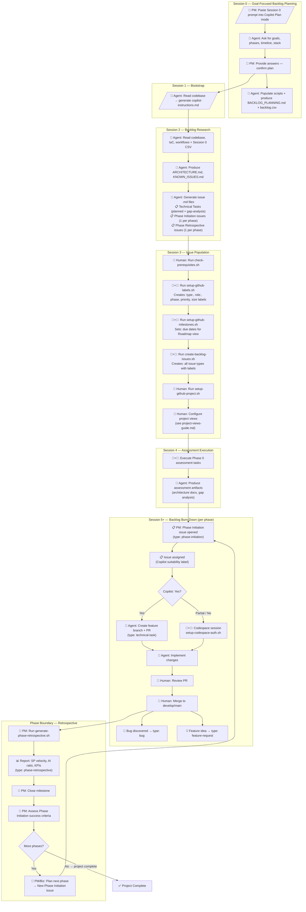
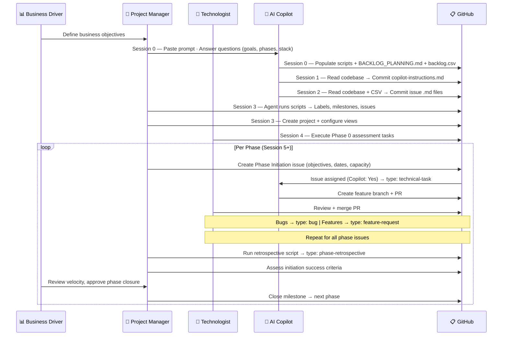
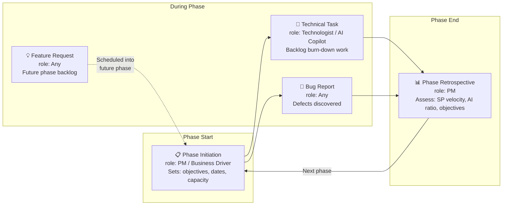

# AgentGitOps — Bootstrap Instructions

> **What is AgentGitOps?** A repeatable, multi-session workflow that combines AI coding agents (GitHub Copilot) with `gh` CLI automation to plan, populate, and burn down a project backlog in GitHub. The pattern works for any repository — copy this `bootstrap/` folder into your project and follow the phases below.

---

## Table of Contents

1. [Workflow Overview](#workflow-overview)
2. [Workflow Diagram](#workflow-diagram)
3. [Prerequisites](#prerequisites)
4. [Organization Roles](#organization-roles)
5. [Phase Guide](#phase-guide)
6. [Issue Type Taxonomy](#issue-type-taxonomy)
7. [Label Taxonomy](#label-taxonomy)
8. [Story Point Capacity Model](#story-point-capacity-model)
9. [Issue Types — Planned vs Gap Analysis](#issue-types--planned-vs-gap-analysis)
10. [Issue Template Specification](#issue-template-specification)
11. [Scripts Reference](#scripts-reference)
12. [Artifacts & Directory Layout](#artifacts--directory-layout)
13. [Adapting for Your Project](#adapting-for-your-project)

---

## Workflow Overview

AgentGitOps operates in **six sessions** (0–5) followed by repeating **phase boundary retrospectives**. Each session has a defined purpose, role (Human, Agent, or both), and set of output artifacts.

| Session | Name | Role | Purpose | Key Artifacts | Issue Types Created |
|---|---|---|---|---|---|
| 0 | Goal-Focused Backlog Planning | Agent-Interactive (PM drives) | Agent asks for goals/phases → populates scripts + initial backlog | `docs/BACKLOG_PLANNING.md`, `artifacts/backlog.csv`, updated scripts | — |
| 1 | Copilot Instructions | Agent | Read codebase → generate `.github/copilot-instructions.md` | `.github/copilot-instructions.md` | — |
| 2 | Backlog Research | Agent | Read codebase + Session 0 CSV → generate issue files | `artifacts/backlog-issues/*.md` | Technical Task, Phase Initiation, Phase Retrospective |
| 3 | Issue Population | Human + Agent in Codespace | Run scripts to create labels, milestones, issues, project | GitHub Issues, Labels, Milestones, Project | All types populated into GitHub |
| 4 | Assessment Execution | Human + Agent | Execute Phase 0 assessment tasks from the backlog | Assessment artifacts, gap findings | Bug, Feature Request (as discovered) |
| 5+ | Backlog Burn-Down | Human + Agent | Work issues via feature branches + Copilot agents | Code changes, PRs, deployments | Bug, Feature Request (as discovered) |
| — | Phase Retrospective | PM | Generate metrics report, close milestone, plan next phase | `docs/retrospectives/phase-N-retrospective.md` | Phase Retrospective (assessed) |

---

## Workflow Diagram

The following diagram shows the full AgentGitOps lifecycle, including roles, artifacts, and the repeating phase cycle.



### Simplified Role Swimlane



### Issue Type Lifecycle



---

## Prerequisites

Before starting the AgentGitOps workflow, verify your environment meets these requirements.

### Required Tools

| Tool | Minimum Version | Check Command |
|---|---|---|
| `gh` CLI | 2.0+ | `gh --version` |
| `git` | 2.30+ | `git --version` |
| `python3` | 3.8+ | `python3 --version` |
| `jq` | 1.6+ | `jq --version` |

### Required GitHub Permissions

| Permission | Scope | Purpose |
|---|---|---|
| Repository read/write | `repo` | Create issues, PRs, manage branches |
| Issues management | (included in `repo`) | Create/edit/label/close issues |
| Pull request management | (included in `repo`) | Create/review/merge PRs |
| GitHub Projects | `project` | Create projects, add items, set fields |
| Organization read | `read:org` | Required if repo is in an organization |

### Quick Permissions Check

Run the included prerequisite script to verify your setup:

```bash
./bootstrap/check-prerequisites.sh
```

This script checks all tools, authentication, and permissions. It outputs either:
- **✅ Good to Go** — All checks passed, ready to proceed
- **❌ Missing Permissions** — Lists what's missing with remediation steps

> **Note:** The `project` scope is not available in Codespace `GITHUB_TOKEN`. For project setup (Session 3, Step 5), either run locally with `gh auth login --scopes "project,repo,read:org"` or use a Personal Access Token.

---

## Organization Roles

AgentGitOps defines four standard roles. In small teams, one person may fill multiple roles.

| Role | Icon | Responsibilities | Issue Types Owned | Copilot Interaction |
|---|---|---|---|---|
| **Project Manager (PM)** | 👤 | Phase planning, milestone management, retrospectives, velocity tracking, unblocking | Phase Initiation, Phase Retrospective | Runs retrospective scripts via Copilot prompts |
| **Technologist** | 🔧 | Technical implementation, code review, architecture decisions, PR management | Technical Task, Bug Report | Guides Copilot on `Partial` issues, reviews AI PRs |
| **AI Copilot** | 🤖 | Automated code generation, test writing, documentation, refactoring | Technical Task (Copilot: Yes) | Autonomous on `Yes` issues, assisted on `Partial` |
| **Business / Functional Driver** | 📊 | Business objectives, acceptance criteria, phase sign-off, feature priorities | Feature Request, Phase Initiation (co-author) | Reviews AI output for business alignment |

### Scaling by Organization Size

| Team Size | PM | Technologist | AI Copilot | Business Driver |
|---|---|---|---|---|
| **Solo / Small** (1–3) | Dev wears PM hat | 1–2 developers | GitHub Copilot agent | Stakeholder or self |
| **Medium** (4–10) | Dedicated PM | 2–5 developers | GitHub Copilot agent | Product owner |
| **Large / Enterprise** (10+) | PM + Scrum Master | Multiple dev teams | GitHub Copilot agent(s) | Multiple stakeholders |

> **Project views scale with team size.** See [Project Views Guide](project-views-guide.md) for role-based view recommendations by organization size.

---

### Session 0: Goal-Focused Backlog Planning

**Session type:** Agent-Interactive (Copilot Plan mode)  
**Role:** PM / Business Driver  
**Time:** 30–60 minutes  
**Model:** Claude Opus 4.6 (Plan mode)

This is the **first step** for any project. The PM opens a Codespace, pastes the Session 0 prompt from `bootstrap/README.md` into Copilot Chat (Plan mode), and answers the agent's questions about project goals, phases, and timeline. The agent then populates all scripts and creates the initial backlog automatically — no manual script editing required.

**Steps:**

1. Copy `bootstrap/` and `.github/ISSUE_TEMPLATE/` into your repository
2. Open in GitHub Codespace — switch Copilot to **Plan mode** with **Claude Opus 4.6**
3. Paste the Session 0 prompt from `bootstrap/README.md` into Copilot Chat
4. Answer the agent's four question groups (project overview, objectives, phases, team/stack)
5. Review the proposed plan and confirm to start implementation
6. Agent populates: `setup-github-labels.sh`, `setup-github-milestones.sh`, `docs/BACKLOG_PLANNING.md`, `artifacts/backlog.csv`
7. Commit and push the populated files

**Agent output checklist:**
- [ ] `bootstrap/setup-github-labels.sh` — phase labels updated to your project's phase names
- [ ] `bootstrap/setup-github-milestones.sh` — milestones updated to your phases with descriptions
- [ ] `docs/BACKLOG_PLANNING.md` — phased plan with task tables, phase objectives, CSV structure
- [ ] `artifacts/backlog.csv` — initial multiphase backlog CSV (used by Sessions 2 and 3)

---

### Session 1: Bootstrap — Insert Copilot Instructions

**Session type:** Manual or Agent  
**Role:** Human  
**Time:** 15–30 minutes

1. Create `.github/copilot-instructions.md` in your repository
2. Include: project context, architecture overview, naming conventions, technology stack, label taxonomy, security reminders
3. Commit to your default branch

**Why:** This file provides persistent context to every Copilot agent session, ensuring consistent, aligned output across all sessions.

**Artifact checklist:**
- [ ] `.github/copilot-instructions.md` committed

---

### Session 2: Backlog Research

**Session type:** Agent (Copilot Chat in VS Code / Copilot Coding Agent)  
**Role:** Agent  
**Time:** 2–4 hours

**Prompt pattern:**
> "Using the Session 0 backlog CSV (`artifacts/backlog.csv`), copilot instructions, and the project codebase, generate individual issue .md files with YAML frontmatter for each task in `artifacts/backlog-issues/`. Mark each issue as either **planned** (from the original project scope) or **gap-analysis-finding** (discovered during assessment). For each phase, also create a Phase Initiation issue (business objectives, dates, capacity) and a Phase Retrospective issue. Also produce architecture and assessment docs."

The agent uses the Session 0 CSV + codebase to produce:

**Artifact checklist:**
- [ ] `artifacts/backlog-issues/*.md` — Individual issue files with YAML frontmatter
- [ ] `docs/ARCHITECTURE.md` — System architecture and component inventory
- [ ] `docs/ASSESSMENT_COMMANDS.md` — CLI commands to verify deployed state
- [ ] `docs/KNOWN_ISSUES.md` — Identified gaps, tech debt, and security concerns
- [ ] `.github/ISSUE_TEMPLATE/backlog-task.yml` — Technical task template
- [ ] `.github/ISSUE_TEMPLATE/phase-initiation.yml` — Phase initiation template
- [ ] `.github/ISSUE_TEMPLATE/phase-retrospective.yml` — Retrospective template
- [ ] `.github/ISSUE_TEMPLATE/bug-report.yml` — Bug report template
- [ ] `.github/ISSUE_TEMPLATE/feature-request.yml` — Feature request template

**Issue types generated per phase:**

| Issue Type | Template | Count per Phase | Created By |
|---|---|---|---|
| Phase Initiation | `phase-initiation.yml` | 1 | PM / Business Driver |
| Technical Task | `backlog-task.yml` | Multiple | Agent (backlog research) |
| Phase Retrospective | `phase-retrospective.yml` | 1 | PM |
| Bug Report | `bug-report.yml` | As needed | Any role |
| Feature Request | `feature-request.yml` | As needed | Any role |

**Issue file format:**
```yaml
---
task_id: "1.2"
phase: 1
phase_name: "Fix Function App"
title: "Upgrade .NET runtime (.NET Core 3.1 → .NET 8)"
issue_type: "planned"           # "planned" or "gap-analysis-finding"
priority: "P1 – Critical"
size: "M (1–2 days)"
copilot_suitable: "Yes"
labels:
  - "Phase 1 - Fix Function App"
  - "P1 – Critical"
  - "M (1–2 days)"
  - "Copilot: Yes"
  - "area: backend"
depends_on: ["1.1"]
---

# [Phase 1] Upgrade .NET runtime

## Description
...

## Acceptance Criteria
- [ ] ...
```

---

### Session 3: Issue Population

**Session type:** Human + Agent in Codespace  
**Role:** Human (with agent assistance)  
**Time:** 1–2 hours

#### Step 1: Check Prerequisites

```bash
./bootstrap/check-prerequisites.sh
```

#### Step 2: Create Labels

```bash
./bootstrap/setup-github-labels.sh [owner/repo]
```

Creates labels across 9 categories: Phase, Priority, Size, Copilot Suitability, Domain Area, Source, Status, Issue Type, and Role (see [Label Taxonomy](#label-taxonomy) below).

#### Step 3: Create Milestones

```bash
./bootstrap/setup-github-milestones.sh [owner/repo]
```

Creates one milestone per phase for date tracking and retrospective metrics.

> **Important for Roadmap view:** After creating milestones, set due dates:
> ```bash
> gh api -X PATCH "repos/{owner}/{repo}/milestones/{number}" -f due_on="2025-07-15T00:00:00Z"
> ```

#### Step 4: Create Issues (Dry Run First)

```bash
# Preview what will be created
./bootstrap/create-backlog-issues.sh --dry-run [owner/repo]

# Create all issues
./bootstrap/create-backlog-issues.sh [owner/repo]
```

Creates GitHub issues with structured titles, full markdown bodies, and auto-applied labels. This includes Technical Tasks, Phase Initiation issues, and Phase Retrospective issues.

#### Step 5: Set Up GitHub Project

> **Requires `project` scope.** Run locally or with a PAT — not in Codespace.

```bash
gh auth login --scopes "project,repo,read:org"
./bootstrap/setup-github-project.sh [owner]
```

Creates a GitHub Project (V2) with custom fields (Phase, Priority, Size, Copilot Suitable) and adds all issues.

#### Step 6: Configure Project Views

GitHub Projects V2 views cannot be fully configured via API. Follow the **[Project Views Guide](project-views-guide.md)** for complete setup instructions.

**Minimum views (all teams):**

| View | Type | Configuration |
|---|---|---|
| **Board** | Board | Group by Status; columns: Backlog, Ready, In Progress, Done |
| **Roadmap** | Roadmap | Date fields: Start/End Date; group by Phase |
| **Current Sprint** | Table | Filter: current phase + Status ≠ Done |
| **Copilot Queue** | Table | Filter: Copilot Suitable = Yes; sort by Phase → Priority |
| **Priority Triage** | Table | Sort by Priority ascending; no group |

**Required fields in every view:** Title, Assignees, Status, Copilot Suitable, Phase, Priority, Size.

> See [Project Views Guide](project-views-guide.md) for the full 10-view setup with role-based recommendations.

---

### Session 5+: Backlog Burn-Down

**Session type:** Human + Agent  
**Role:** Mixed (based on Copilot suitability label)  
**Time:** Ongoing across project phases

#### Phase Start — PM Creates Phase Initiation Issue

At the **start of each phase**, the PM (or Business Driver) creates a **Phase Initiation** issue using the `phase-initiation.yml` template. This defines:
- Business/functional objectives for the phase
- Planned start and end dates (drives Roadmap view)
- Planned capacity in story points
- Success criteria for retrospective assessment
- Team and role assignments

#### For `Copilot: Yes` Issues (Technical Tasks)

1. Assign issue to Copilot via GitHub UI
2. Copilot creates feature branch and PR
3. Human reviews and merges PR

#### For `Copilot: Partial` or `Copilot: No` Issues

1. Human opens Codespace on feature branch
2. Run auth setup: `bash scripts/setup-codespace-auth.sh`
3. Use the standard session start prompt (paste into Copilot Chat):

```
Set up this Codespace for working on issue #{ISSUE_NUMBER}:

1. Run `bash scripts/setup-codespace-auth.sh` to authenticate
2. Fetch the issue details: `gh issue view {ISSUE_NUMBER}`
3. Read the acceptance criteria and identify the first actionable step
4. Check current branch and confirm it tracks the correct feature branch
5. Review the relevant source files mentioned in the issue
6. Propose an implementation plan based on the acceptance criteria

Start with step 1 and proceed through each step, pausing after the plan for review.
```

#### During Phase — Ad-Hoc Issue Creation

During burn-down, team members may discover issues that weren't in the original backlog:

| Situation | Issue Type | Template | Created By |
|---|---|---|---|
| Defect found during testing | Bug Report | `bug-report.yml` | Technologist or PM |
| New capability needed | Feature Request | `feature-request.yml` | Business Driver or PM |
| Assessment gap discovered | Technical Task + `gap-analysis-finding` label | `backlog-task.yml` | Agent or Technologist |

#### Phase Boundary — Retrospective

At the end of each phase, the PM:

1. **Runs the retrospective script:**
```bash
./bootstrap/generate-phase-retrospective.sh <phase_number>

# The script automatically:
# 1. Collects issue/PR/commit stats from the milestone
# 2. Calculates Human vs Copilot AI Productivity KPI
# 3. Calculates story point velocity (SP delivered vs planned)
# 4. Writes docs/retrospectives/phase-N-retrospective.md
# 5. Posts report as a comment on the retrospective issue
```

2. **Assesses the Phase Initiation success criteria** — reviews each objective
3. **Records velocity metrics** — SP/day, AI ratio, capacity utilization
4. **Closes the milestone**
5. **Plans the next phase** — creates new Phase Initiation issue with updated capacity/dates

#### Future Phase Planning (Beyond Initial Backlog)

After the initial 5-session setup completes, the workflow **repeats** for additional phases:

1. **Feature Requests** accumulated during burn-down feed into the next phase's backlog
2. **Gap analysis findings** from retrospectives create new Technical Tasks
3. The PM creates a **new Phase Initiation** issue with revised objectives
4. The cycle continues: Initiation → Burn-Down → Retrospective → Next Phase

---

## Issue Type Taxonomy

AgentGitOps uses **5 issue types**, each with a dedicated template and aligned to specific roles and phases.

| Issue Type | Template | Label | Created By | When | Per Phase |
|---|---|---|---|---|---|
| **Phase Initiation** | `phase-initiation.yml` | `type: phase-initiation` | PM / Business Driver | Phase start | 1 |
| **Technical Task** | `backlog-task.yml` | `type: technical-task` | Agent / Technologist | Session 3 + ongoing | Multiple |
| **Phase Retrospective** | `phase-retrospective.yml` | `type: phase-retrospective` | PM | Phase end | 1 |
| **Bug Report** | `bug-report.yml` | `type: bug` | Any role | As discovered | As needed |
| **Feature Request** | `feature-request.yml` | `type: feature-request` | Any role | As discovered | As needed |

### Issue Type → Role Matrix

| Issue Type | PM | Technologist | AI Copilot | Business Driver |
|---|---|---|---|---|
| Phase Initiation | **Creates** | Reviews | — | **Co-authors** |
| Technical Task | Assigns | **Implements** | **Implements** (if Yes) | — |
| Phase Retrospective | **Creates & assesses** | Provides input | — | Reviews |
| Bug Report | Triages | **Creates & fixes** | Fixes (if Yes) | Reports |
| Feature Request | Schedules | Estimates | — | **Creates** |

### Issue Type → Phase Alignment

```
Phase Start ──► Phase Initiation (1 per phase)
                    │
                    ▼
Burn-Down ─────► Technical Tasks (multiple)
                    │  ┌── Bug Reports (as discovered)
                    │  └── Feature Requests (future backlog)
                    ▼
Phase End ─────► Phase Retrospective (1 per phase)
                    │
                    ▼
Next Phase ────► Phase Initiation (cycle repeats)
```

---

## Label Taxonomy

AgentGitOps uses a structured label taxonomy with **9 categories** to enable project views, filtering, and automation.

### Category: Phase

Track which project phase an issue belongs to.

| Label | Color | Description |
|---|---|---|
| `Phase 0 - Assessment` | `#0E8A16` (green) | Phase 0: Assessment and credential verification |
| `Phase 1 - Fix Function App` | `#0E8A16` | Phase 1: Restore visitor counter functionality |
| `Phase 2 - Content Update` | `#0E8A16` | Phase 2: Update resume site content |
| `Phase 3 - Dev Deployment` | `#0E8A16` | Phase 3: Deploy to development environment |
| `Phase 4 - Prod Deployment` | `#0E8A16` | Phase 4: Deploy to production environment |
| `Phase 5 - Cleanup & Docs` | `#0E8A16` | Phase 5: Cleanup and documentation |

> **Customization:** Update phase names and count to match your project. Phase labels map 1:1 with milestones.

### Category: Priority

Standard 4-tier priority for issue triage.

| Label | Color | Description |
|---|---|---|
| `P1 – Critical` | `#B60205` (red) | Must be done immediately — blocking or high-risk |
| `P2 – High` | `#D93F0B` (orange) | Important for this phase — core deliverable |
| `P3 – Medium` | `#FBCA04` (yellow) | Should be done this phase — quality / completeness |
| `P4 – Low` | `#0075CA` (blue) | Nice to have — defer if needed |

### Category: Size (with Story Points)

T-shirt sizing for sprint planning and capacity estimation. Each size maps to a story point value.

| Label | Color | Story Points | Hours | Description |
|---|---|---|---|---|
| `S (half-day)` | `#C2E0C6` (light green) | 1 SP | 2.5 hrs | Small task, less than 4 hours |
| `M (1–2 days)` | `#C2E0C6` | 3 SP | 7.5 hrs | Medium task, 1–2 working days |
| `L (3–5 days)` | `#C2E0C6` | 8 SP | 20 hrs | Large task, 3–5 working days |
| `XL (1 week+)` | `#C2E0C6` | 13 SP | 32.5+ hrs | Extra-large, consider breaking down |

### Category: Copilot Suitability

Determines whether an issue can be assigned to the Copilot coding agent. **This is one of the most important fields in the entire workflow** — it drives the AI productivity KPI and determines which issues appear in the Copilot Queue view.

This value is tracked in **two places that must stay in sync**:

- **GitHub Project field** — `Copilot Suitable` (single-select: `Yes`, `Partial`, `No`). Used for project view filters (`Copilot Suitable = Yes`) and KPI calculations.
- **GitHub issue label** — `Copilot: Yes`, `Copilot: Partial`, or `Copilot: No`. Used for repo-wide label filters and the `create-backlog-issues.sh` script.

These map 1:1: `Copilot Suitable = Yes` ↔ label `Copilot: Yes`, etc. Always set both when creating or updating an issue. Omitting either means the issue may be missing from KPI or queue calculations.

| Label | Project Field Value | Color | Description | Assignment Guide |
|---|---|---|---|---|
| `Copilot: Yes` | `Yes` | `#6F42C1` (purple) | Fully automatable by Copilot agent | Code generation, refactoring, test writing, docs, scripting |
| `Copilot: Partial` | `Partial` | `#D4C5F9` (light purple) | Agent assists, human guides | Requires judgment + code — human reviews agent output |
| `Copilot: No` | `No` | `#E4E669` (light yellow) | Human-only work | Azure Portal, credential management, manual verification |

> **Why it matters:** The **Copilot Queue** project view (filter: `Copilot Suitable = Yes`, sort: Phase → Priority) is the primary interface for assigning work to AI agents. The Human vs AI productivity KPI — *AI SP delivered ÷ total SP* — is calculated directly from this field at each phase retrospective. Prioritizing `Copilot: Yes` issues for agent assignment maximizes throughput and demonstrates measurable AI leverage.

### Category: Domain Area

Route issues by technical domain.

| Label | Color | Description |
|---|---|---|
| `area: infrastructure` | `#1D76DB` (blue) | Azure infrastructure and Bicep IaC |
| `area: backend` | `#1D76DB` | Backend services (Azure Functions, .NET) |
| `area: frontend` | `#1D76DB` | Frontend static site (HTML/CSS/JS) |
| `area: ci-cd` | `#1D76DB` | GitHub Actions workflows and CI/CD pipelines |
| `area: dns-cdn` | `#1D76DB` | DNS and CDN configuration (Cloudflare) |
| `area: documentation` | `#1D76DB` | Documentation and knowledge base |
| `area: credentials` | `#1D76DB` | Secrets, tokens, and service principals |

### Category: Source (Issue Origin)

Track where an issue originated — critical for distinguishing planned work from discovered work.

| Label | Color | Description |
|---|---|---|
| `gap-analysis-finding` | `#F9D0C4` (salmon) | Discovered during assessment — not in the original plan |
| `phase-retrospective` | `#FEF2C0` (gold) | Phase wrap-up retrospective issue |

### Category: Issue Type

Classify issues by their functional purpose in the workflow.

| Label | Color | Description |
|---|---|---|
| `type: technical-task` | `#5319E7` (purple) | Technical implementation — Technologist or AI Copilot |
| `type: phase-initiation` | `#0052CC` (dark blue) | Phase objectives — created by PM at phase start |
| `type: phase-retrospective` | `#FEF2C0` (gold) | Phase retrospective — PM assessment at phase boundary |
| `type: bug` | `#D73A4A` (red) | Bug report — defect found during dev, test, or prod |
| `type: feature-request` | `#A2EEEF` (light blue) | Feature request — enhancement for current or future phase |

### Category: Role

Track which organizational role owns or is assigned to an issue.

| Label | Color | Description |
|---|---|---|
| `role: technologist` | `#BFD4F2` (light blue) | Assigned to Technologist (human developer) |
| `role: ai-copilot` | `#D4C5F9` (light purple) | Assigned to AI Copilot agent |
| `role: project-manager` | `#F9D0C4` (salmon) | Owned by Project Manager |
| `role: business-driver` | `#FEF2C0` (gold) | Owned by Business/Functional Driver |

### Category: Status

**Status is a GitHub Project field** (single-select), not a GitHub label. The 7 options below are configured directly on the project's built-in **Status** field — one column per option on the Board view. Use `bootstrap/setup-github-project.sh` to create the project, then update the Status field options in the GitHub Project settings to match these values.

> **Optional:** `bootstrap/setup-github-labels.sh` also creates matching GitHub labels (e.g., `🔲 Backlog`) for repo-wide status filtering outside the project view. However, the **project field** is the authoritative source for board views and status filters (`Status = 🔲 Backlog`).

The full status lifecycle flows left-to-right through the board:

```
🔲 Backlog → ✅ Ready → 🔄 In Progress → 👀 In Review → Done
                                               ↓              ↑
                                         🚫 Blocked ────────→ (unblocked)
                                         📦 Deferred  (moved out of current phase)
```

| Status Field Option | Color | Description |
|---|---|---|
| `🔲 Backlog` | `#EDEDED` (gray) | In the backlog, not yet started |
| `✅ Ready` | `#0E8A16` (green) | Groomed and ready to start |
| `🔄 In Progress` | `#0075CA` (blue) | Actively being worked on |
| `👀 In Review` | `#8A63D2` (purple) | Under review (PR open or awaiting feedback) |
| `Done` | `#2EA44F` (dark green) | Completed — no further action required |
| `🚫 Blocked` | `#B60205` (red) | Blocked by dependency or external factor |
| `📦 Deferred` | `#C5DEF5` (light blue) | Intentionally deferred to a future phase |

---

## Issue Types — Planned vs Gap Analysis

During Session 3 (Backlog Research), the agent generates two types of issues:

### Planned Issues

Issues that come from the **original project scope** — identified during initial planning before any assessment of live infrastructure.

- Derived from project goals and requirements
- Present in `BACKLOG_PLANNING.md` from the start
- Do **not** carry the `gap-analysis-finding` label
- Example: "Upgrade .NET runtime (.NET Core 3.1 → .NET 8)"

### Gap-Analysis-Finding Issues

Issues **discovered during assessment** of live infrastructure that were not in the original plan.

- Identified by comparing expected state (from IaC/docs) with actual state (from assessment commands)
- Carry the `gap-analysis-finding` label
- Added to `BACKLOG_PLANNING.md` after discovery
- Example: "Set FtpsState to Disabled on Function App" (discovered live configuration didn't match security best practices)

### YAML Frontmatter Notation

Issue `.md` files use the `issue_type` field in YAML frontmatter to distinguish:

```yaml
---
task_id: "1.12"
issue_type: "gap-analysis-finding"   # ← Discovered during assessment
labels:
  - "gap-analysis-finding"           # ← Also applied as a label
  - "Phase 1 - Fix Function App"
---
```

vs.

```yaml
---
task_id: "1.2"
issue_type: "planned"                # ← Part of original project scope
labels:
  - "Phase 1 - Fix Function App"
---
```

### Gap Analysis Cycle

The gap analysis cycle can repeat at any phase boundary:

1. **Run assessment commands** against live infrastructure
2. **Compare** actual state with expected state from IaC/docs
3. **Create new issue files** with `issue_type: "gap-analysis-finding"` and the `gap-analysis-finding` label
4. **Update `BACKLOG_PLANNING.md`** — add new tasks to the appropriate phase tables
5. **Run issue creation for new files only:**
   ```bash
   ./bootstrap/create-backlog-issues.sh artifacts/backlog-issues/{new_files}.md
   ```

---

## Story Point Capacity Model

AgentGitOps uses a standardized story point system for velocity measurement and capacity planning. This is critical for accurate planned-vs-actual KPIs in phase retrospectives.

### T-Shirt to Story Point Mapping

| Size | Story Points | Hours | Calendar Days | Description |
|---|---|---|---|---|
| **S** (half-day) | **1 SP** | 2.5 hours | < 1 day | Small, well-defined task |
| **M** (1–2 days) | **3 SP** | 7.5 hours | 1–2 days | Medium complexity, may span files |
| **L** (3–5 days) | **8 SP** | 20 hours | 3–5 days | Large task, multiple components |
| **XL** (1 week+) | **13 SP** | 32.5+ hours | 5+ days | Consider breaking down |

### Capacity Constants

| Constant | Value | Notes |
|---|---|---|
| **1 Story Point** | 2.5 hours | Base unit of effort |
| **Developer capacity/day** | 3 SP (7.5 hours) | Accounts for meetings, context switching |
| **Working days/week** | 5 days | Standard work week |
| **Developer capacity/week** | 15 SP | 3 SP × 5 days |
| **Sprint (2 weeks)** | 30 SP/developer | Planning ceiling per developer |

### Phase Capacity Planning

```
Phase Capacity = Team Size × 3 SP/day × Working Days in Phase

Example: 1 developer, 2-week phase
  = 1 × 3 × 10 = 30 SP planned capacity
```

The Phase Initiation issue captures planned capacity, and the Phase Retrospective calculates:
- **Total SP delivered** = Sum of story points on closed issues
- **AI-delivered SP** = SP on issues labeled `Copilot: Yes` that were closed
- **Human-delivered SP** = Total SP − AI-delivered SP
- **AI velocity ratio** = AI-delivered SP ÷ Total SP delivered
- **Velocity (SP/day)** = Total SP delivered ÷ Phase duration in working days

> See [Project Views Guide](project-views-guide.md) for how story points surface in project views.

---

## Issue Template Specification

Five issue templates support the AgentGitOps workflow:

### Phase Initiation Template (`.github/ISSUE_TEMPLATE/phase-initiation.yml`)

Created by **PM / Business Driver** at the start of each phase. Key fields:

| Field | Type | Required | Purpose |
|---|---|---|---|
| Phase | Dropdown | Yes | Which phase this covers |
| Milestone | Input | Yes | GitHub Milestone name |
| Planned Start Date | Input | Yes | ISO 8601 date — drives Roadmap view |
| Planned End Date | Input | Yes | ISO 8601 date — drives Roadmap view |
| Planned Capacity (SP) | Input | Yes | Total story points for phase |
| Business Objectives | Textarea | Yes | High-level goals |
| Success Criteria | Textarea | Yes | Measurable criteria for retrospective |
| Scope Boundaries | Textarea | No | In/out of scope |
| Risks & Dependencies | Textarea | No | Known risks |
| Team Assignments | Textarea | No | Role → person mapping |
| Retrospective Checklist | Textarea | Pre-filled | PM completes at phase end |

### Technical Task Template (`.github/ISSUE_TEMPLATE/backlog-task.yml`)

Used for all technical work items. Fields:

| Field | Type | Required | Purpose |
|---|---|---|---|
| Task ID | Input | Yes | Unique `phase.sequence` identifier (e.g., `1.3`) |
| Phase | Dropdown | Yes | Project phase (0–5) |
| Task Description | Textarea | Yes | Detailed work description |
| Dependencies | Input | No | Comma-separated task IDs |
| Priority | Dropdown | Yes | P1–P4 |
| Estimated Size | Dropdown | Yes | S (1 SP) / M (3 SP) / L (8 SP) / XL (13 SP) |
| Copilot Suitable | Dropdown | Yes | Yes / Partial / No |
| Acceptance Criteria | Textarea | Yes | Checkbox list of done conditions |
| Copilot Instructions Reference | Textarea | No | Links to relevant Copilot instructions |
| Assessment Notes | Textarea | No | Notes populated after Phase 0 assessment |

### Phase Retrospective Template (`.github/ISSUE_TEMPLATE/phase-retrospective.yml`)

Created by **PM** at phase end. Key fields: Phase, Milestone, Planned Issue Count, Phase Summary, Planned vs Actual, Story Point Velocity, Human vs Copilot KPI, Gap Analysis Summary, Next Phase Readiness Checklist, and a standard Copilot Prompt for report generation.

### Bug Report Template (`.github/ISSUE_TEMPLATE/bug-report.yml`)

Created by **any role** when a defect is discovered. Key fields:

| Field | Type | Required | Purpose |
|---|---|---|---|
| Discovered in Phase | Dropdown | Yes | Which phase the bug was found in |
| Severity | Dropdown | Yes | P1–P4 severity classification |
| Environment | Dropdown | Yes | Local / Dev / Prod / CI/CD |
| Bug Description | Textarea | Yes | What is wrong |
| Steps to Reproduce | Textarea | Yes | How to reproduce |
| Expected vs Actual | Textareas | Yes | What should happen vs what does |
| Copilot Suitable | Dropdown | Yes | Can Copilot fix this? |
| Estimated Fix Size | Dropdown | No | T-shirt size with story points |

### Feature Request Template (`.github/ISSUE_TEMPLATE/feature-request.yml`)

Created by **Business Driver, PM, or Technologist** for future phase planning. Key fields:

| Field | Type | Required | Purpose |
|---|---|---|---|
| Target Phase | Dropdown | No | Which phase to schedule in (or Unscheduled) |
| Feature Description | Textarea | Yes | What should be built |
| Business Value | Textarea | Yes | Why this is needed |
| Acceptance Criteria | Textarea | Yes | Done conditions |
| Priority | Dropdown | No | Suggested priority |
| Size | Dropdown | No | T-shirt estimate with story points |
| Copilot Suitable | Dropdown | No | Can Copilot implement? |

---

## Scripts Reference

| Script | Purpose | Auth Required | When to Run |
|---|---|---|---|
| `bootstrap/check-prerequisites.sh` | Verify tools, auth, and permissions | None (checks auth) | Before Session 3 |
| `bootstrap/setup-github-labels.sh` | Create/update all labels (idempotent) | `GITHUB_TOKEN` | Session 3, Step 2 |
| `bootstrap/setup-github-milestones.sh` | Create milestones for each phase | `GITHUB_TOKEN` | Session 3, Step 3 |
| `bootstrap/create-backlog-issues.sh` | Create issues from `.md` files | `GITHUB_TOKEN` | Session 3, Step 4 |
| `bootstrap/setup-github-project.sh` | Create project + fields + add issues | `project` scope | Session 3, Step 5 |
| `bootstrap/generate-phase-retrospective.sh` | Generate phase retrospective report | `GITHUB_TOKEN` | Each phase boundary |
| `scripts/setup-codespace-auth.sh` | Authenticate Azure + GitHub + Cloudflare | Codespace Secrets | Each Codespace session |
| `scripts/cleanup-stack.sh` | Inventory/purge old stack resources | Azure CLI + Cloudflare | Phase 5 (cleanup) |

---

## Artifacts & Directory Layout

AgentGitOps produces artifacts in specific locations. This separation keeps reusable workflow docs clean from project-specific assessment data.

```
your-repo/
├── bootstrap/                          # ← Reusable AgentGitOps package
│   ├── README.md                       #    Directory overview — start here
│   ├── agentgitops-instructions.md     #    This file — full workflow guide
│   ├── backlog_workflow.md             #    Project-specific workflow reference
│   ├── project-views-guide.md          #    Project setup & views guide
│   ├── check-prerequisites.sh          #    Permissions verification script
│   ├── setup-github-labels.sh          #    Create/update all labels
│   ├── setup-github-milestones.sh      #    Create milestones per phase
│   ├── create-backlog-issues.sh        #    Create issues from .md files
│   ├── setup-github-project.sh         #    Create project + add issues
│   ├── generate-phase-retrospective.sh #    Generate phase retrospective report
│   ├── project-fields.json             #    GitHub Project V2 field/option IDs
│   └── backlog-template.csv           #    Session 0 CSV template
│
├── .github/
│   ├── copilot-instructions.md         # Project-specific agent context
│   └── ISSUE_TEMPLATE/
│       ├── backlog-task.yml            # Technical task template
│       ├── phase-initiation.yml        # Phase initiation template (PM)
│       ├── phase-retrospective.yml     # Retrospective template (PM)
│       ├── bug-report.yml              # Bug report template (any role)
│       └── feature-request.yml         # Feature request template (any role)
│
├── docs/                               # ← Core project documentation
│   ├── ARCHITECTURE.md                 #    System architecture reference
│   ├── ASSESSMENT_COMMANDS.md          #    CLI commands for state verification
│   ├── BACKLOG_PLANNING.md             #    Phased plan with task tables
│   ├── CICD_WORKFLOWS.md              #    CI/CD pipeline documentation
│   ├── KNOWN_ISSUES.md                #    Technical debt and known issues
│   ├── LOCAL_TESTING.md               #    Local development guide
│   └── retrospectives/                #    Phase retrospective reports
│       ├── phase-0-retrospective.md
│       └── ...
│
├── scripts/                            # ← Project-specific operational scripts
│   ├── setup-codespace-auth.sh         #    Auth setup for Codespace sessions
│   ├── cleanup-stack.sh                #    Blue/green stack cleanup
│   └── ...                             #    Other project-specific scripts
│
└── artifacts/                          # ← Project-specific output artifacts
    ├── backlog.csv                      #    Initial Session 0 planning CSV
    ├── backlog-issues/                 #    Issue .md files with YAML frontmatter
    │   ├── 0.1.md ... 0.14.md         #    Phase 0 tasks
    │   ├── 1.1.md ... 1.13.md         #    Phase 1 tasks
    │   └── ...                         #    (one file per issue)
    ├── session-prompts/                #    Session prompt archives
    ├── assessments/                    #    Assessment findings and diagnostics
    └── inventory-*.json                #    Azure/Cloudflare resource inventories
```

### What Goes Where

| Artifact Type | Location | Reason |
|---|---|---|
| Reusable workflow instructions + scripts | `bootstrap/` | Portable — copy to any project |
| Project views guide | `bootstrap/project-views-guide.md` | Role-based view setup reference |
| Session 0 CSV template | `bootstrap/backlog-template.csv` | Reusable starting point |
| Issue templates (5 types) | `.github/ISSUE_TEMPLATE/` | GitHub-native issue creation forms |
| Core project docs | `docs/` | Living documentation, updated each phase |
| Phase retrospective reports | `docs/retrospectives/` | Persistent git record of metrics |
| Initial planning backlog CSV | `artifacts/backlog.csv` | Session 0 output, used by Sessions 2–3 |
| Backlog issue definitions | `artifacts/backlog-issues/` | Input for issue creation script |
| Session prompts (archived) | `artifacts/session-prompts/` | Historical record, not active docs |
| Assessment findings | `artifacts/assessments/` | Phase-specific diagnostics, not active docs |
| Resource inventory JSON | `artifacts/` | Blue/green stack snapshots for traceability |

---

## Adapting for Your Project

To use AgentGitOps in a new repository:

### Quick Start (3 Steps)

1. **Copy the `bootstrap/` folder** and `.github/ISSUE_TEMPLATE/` into your repository
2. **Open in GitHub Codespace** — switch Copilot to Plan mode with Claude Opus 4.6
3. **Paste the Session 0 prompt** from `bootstrap/README.md` — answer the agent's questions and the agent populates all scripts automatically

> **No manual script editing required.** The Session 0 agent handles phase labels, milestones, and the initial backlog CSV based on your answers. See `bootstrap/README.md` for the complete prompt and standard project templates.

### What the Session 0 Agent Customizes

| What | Where | How the Agent Updates It |
|---|---|---|
| Phase names and count | `bootstrap/setup-github-labels.sh` | Replaces `# CUSTOMIZE:` phase arrays with your phases |
| Milestone names | `bootstrap/setup-github-milestones.sh` | Replaces MILESTONES array with your phases + descriptions |
| Initial backlog | `artifacts/backlog.csv` | Generates tasks from your objectives using `backlog-template.csv` |
| Phased plan doc | `docs/BACKLOG_PLANNING.md` | Creates with your objectives, phases, and capacity estimates |
| Copilot instructions | `.github/copilot-instructions.md` | Created in Session 1 from codebase analysis |
| Project field IDs | `bootstrap/project-fields.json` | Refreshed in Session 3 after project creation |

### Key Design Decisions

- **Session 0 prompt-driven setup** — business objectives and phases flow in once, populate everything
- **Session 0 CSV** in `artifacts/backlog.csv` provides the canonical planning foundation for all subsequent sessions
- **YAML frontmatter** in issue `.md` files enables scripted label extraction without a separate CSV/JSON mapping
- **Phased structure** provides natural ordering and dependency tracking
- **Copilot suitability labels** allow filtering for agent-automatable tasks
- **Dry-run support** in the issue creation script prevents accidental duplicates
- **Idempotent label/milestone scripts** — safe to re-run without side effects
- **`issue_type` field** (`planned` vs `gap-analysis-finding`) tracks whether work was planned upfront or discovered during assessment

---

## Human vs Copilot AI Productivity KPI

The retrospective script tracks AI leverage at three levels:

- **Task-level:** Closed issues labeled `Copilot: Yes` ÷ total closed issues
- **Commit-level:** Commits with `Co-authored-by` Copilot trailers ÷ total commits
- **Story point velocity:** AI-delivered SP ÷ total SP delivered (requires size labels on issues)

### Velocity Measurement

| Metric | Formula | Source |
|---|---|---|
| Total SP delivered | Sum of SP on closed issues | Size label → SP mapping |
| AI SP delivered | SP on closed `Copilot: Yes` issues | Size + Copilot labels |
| Human SP delivered | Total SP − AI SP | Calculated |
| AI velocity ratio | AI SP ÷ Total SP | Calculated |
| Phase velocity | Total SP ÷ working days | Calculated |
| Planned vs actual | Delivered SP ÷ planned SP (from Phase Initiation) | Phase Initiation issue |

These metrics are captured in each phase retrospective and provide insight into how effectively AI agents are being utilized for project delivery.

---

## Reference Implementation

This workflow pattern was developed and demonstrated on the [azure-resume-iac](https://github.com/rmcveyhsawaknow/azure-resume-iac) project — a multi-phase infrastructure-as-code update for an Azure-hosted resume site. That repository serves as the reference implementation with 6 phases, 80+ issues, and complete retrospective data.
