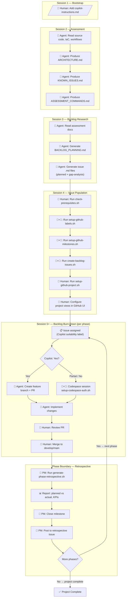
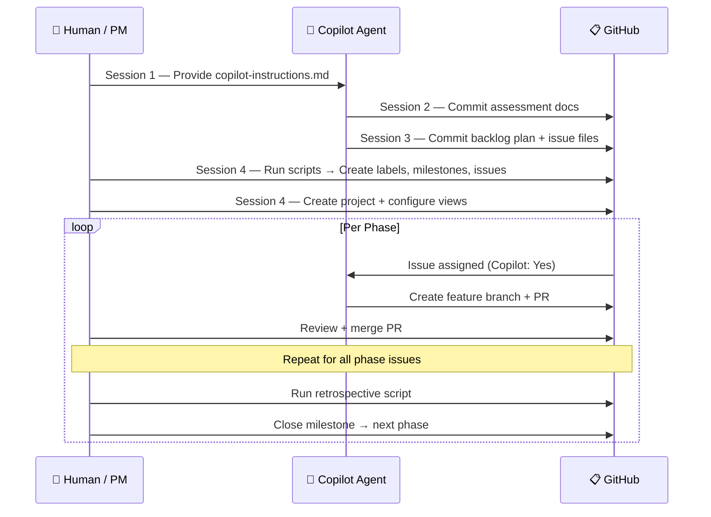

# AgentGitOps — Bootstrap Instructions

> **What is AgentGitOps?** A repeatable, multi-session workflow that combines AI coding agents (GitHub Copilot) with `gh` CLI automation to plan, populate, and burn down a project backlog in GitHub. The pattern works for any repository — copy this `bootstrap/` folder into your project and follow the phases below.

---

## Table of Contents

1. [Workflow Overview](#workflow-overview)
2. [Workflow Diagram](#workflow-diagram)
3. [Prerequisites](#prerequisites)
4. [Phase Guide](#phase-guide)
5. [Label Taxonomy](#label-taxonomy)
6. [Issue Types — Planned vs Gap Analysis](#issue-types--planned-vs-gap-analysis)
7. [Issue Template Specification](#issue-template-specification)
8. [Scripts Reference](#scripts-reference)
9. [Artifacts & Directory Layout](#artifacts--directory-layout)
10. [Adapting for Your Project](#adapting-for-your-project)

---

## Workflow Overview

AgentGitOps operates in **five sessions** followed by repeating **phase boundary retrospectives**. Each session has a defined purpose, role (Human, Agent, or both), and set of output artifacts.

| Session | Name | Role | Purpose | Key Artifacts |
|---|---|---|---|---|
| 1 | Copilot Instructions | Human / Agent | Add `.github/copilot-instructions.md` to provide agent context | `copilot-instructions.md` |
| 2 | Assessment | Agent | Read source, IaC, workflows → produce architecture docs | `ARCHITECTURE.md`, `KNOWN_ISSUES.md`, `ASSESSMENT_COMMANDS.md` |
| 3 | Backlog Research | Agent | Generate phased backlog plan + individual issue files | `BACKLOG_PLANNING.md`, `scripts/backlog-issues/*.md` |
| 4 | Issue Population | Human + Agent | Run scripts to create labels, milestones, issues, project | GitHub Issues, Labels, Milestones, Project |
| 5+ | Backlog Burn-Down | Human + Agent | Work issues via feature branches + Copilot agents | Code changes, PRs, deployments |
| — | Phase Retrospective | PM | Generate metrics report, close milestone, plan next phase | `docs/retrospectives/phase-N-retrospective.md` |

---

## Workflow Diagram

The following diagram shows the full AgentGitOps lifecycle, including roles, artifacts, and the repeating phase cycle.



### Simplified Role Swimlane



---

## Prerequisites

Before starting the AgentGitOps workflow, verify your environment meets these requirements.

### Required Tools

| Tool | Minimum Version | Check Command |
|---|---|---|
| `gh` CLI | 2.0+ | `gh --version` |
| `git` | 2.30+ | `git --version` |
| `python3` | 3.8+ | `python3 --version` |
| `jq` | 1.6+ | `jq --version` |

### Required GitHub Permissions

| Permission | Scope | Purpose |
|---|---|---|
| Repository read/write | `repo` | Create issues, PRs, manage branches |
| Issues management | (included in `repo`) | Create/edit/label/close issues |
| Pull request management | (included in `repo`) | Create/review/merge PRs |
| GitHub Projects | `project` | Create projects, add items, set fields |
| Organization read | `read:org` | Required if repo is in an organization |

### Quick Permissions Check

Run the included prerequisite script to verify your setup:

```bash
./bootstrap/check-prerequisites.sh
```

This script checks all tools, authentication, and permissions. It outputs either:
- **✅ Good to Go** — All checks passed, ready to proceed
- **❌ Missing Permissions** — Lists what's missing with remediation steps

> **Note:** The `project` scope is not available in Codespace `GITHUB_TOKEN`. For project setup (Session 4, Step 5), either run locally with `gh auth login --scopes "project,repo,read:org"` or use a Personal Access Token.

---

## Phase Guide

### Phase 1 of 5: Bootstrap — Insert Copilot Instructions

**Session type:** Manual or Agent  
**Role:** Human  
**Time:** 15–30 minutes

1. Create `.github/copilot-instructions.md` in your repository
2. Include: project context, architecture overview, naming conventions, technology stack, label taxonomy, security reminders
3. Commit to your default branch

**Why:** This file provides persistent context to every Copilot agent session, ensuring consistent, aligned output across all sessions.

**Artifact checklist:**
- [ ] `.github/copilot-instructions.md` committed

---

### Phase 2 of 5: Assessment Session

**Session type:** Agent (Copilot Chat in VS Code / Copilot Coding Agent)  
**Role:** Agent  
**Time:** 1–2 hours

**Prompt pattern:**
> "Assess this repository. Read all source files, IaC, workflows, and configuration. Produce architecture docs, assessment CLI commands, and a known-issues list."

The agent reads all source files, IaC templates, workflows, and configuration to produce:

**Artifact checklist:**
- [ ] `docs/ARCHITECTURE.md` — System architecture and component inventory
- [ ] `docs/ASSESSMENT_COMMANDS.md` — CLI commands to verify deployed state
- [ ] `docs/KNOWN_ISSUES.md` — Identified gaps, tech debt, and security concerns
- [ ] `docs/CICD_WORKFLOWS.md` — CI/CD pipeline documentation (optional)

---

### Phase 3 of 5: Backlog Research Session

**Session type:** Agent (Copilot Chat in VS Code / Copilot Coding Agent)  
**Role:** Agent  
**Time:** 2–4 hours

**Prompt pattern:**
> "Using the assessment docs and copilot instructions, create a phased backlog plan and generate individual issue .md files with YAML frontmatter for each task. Mark each issue as either **planned** (from the original project scope) or **gap-analysis-finding** (discovered during assessment)."

The agent uses assessment output + copilot instructions to produce:

**Artifact checklist:**
- [ ] `docs/BACKLOG_PLANNING.md` — Phased plan with task breakdown tables
- [ ] `scripts/backlog-issues/*.md` — Individual issue files with YAML frontmatter
- [ ] `.github/ISSUE_TEMPLATE/backlog-task.yml` — Issue template for manual creation
- [ ] `.github/ISSUE_TEMPLATE/phase-retrospective.yml` — Retrospective issue template

**Issue file format:**
```yaml
---
task_id: "1.2"
phase: 1
phase_name: "Fix Function App"
title: "Upgrade .NET runtime (.NET Core 3.1 → .NET 8)"
issue_type: "planned"           # "planned" or "gap-analysis-finding"
priority: "P1 – Critical"
size: "M (1–2 days)"
copilot_suitable: "Yes"
labels:
  - "Phase 1 - Fix Function App"
  - "P1 – Critical"
  - "M (1–2 days)"
  - "Copilot: Yes"
  - "area: backend"
depends_on: ["1.1"]
---

# [Phase 1] Upgrade .NET runtime

## Description
...

## Acceptance Criteria
- [ ] ...
```

---

### Phase 4 of 5: Issue Population Session

**Session type:** Human + Agent in Codespace  
**Role:** Human (with agent assistance)  
**Time:** 1–2 hours

#### Step 1: Check Prerequisites

```bash
./bootstrap/check-prerequisites.sh
```

#### Step 2: Create Labels

```bash
./scripts/setup-github-labels.sh [owner/repo]
```

Creates labels across 7 categories (see [Label Taxonomy](#label-taxonomy) below).

#### Step 3: Create Milestones

```bash
./scripts/setup-github-milestones.sh [owner/repo]
```

Creates one milestone per phase for date tracking and retrospective metrics.

#### Step 4: Create Issues (Dry Run First)

```bash
# Preview what will be created
./scripts/create-backlog-issues.sh --dry-run [owner/repo]

# Create all issues
./scripts/create-backlog-issues.sh [owner/repo]
```

Creates GitHub issues with structured titles, full markdown bodies, and auto-applied labels.

#### Step 5: Set Up GitHub Project

> **Requires `project` scope.** Run locally or with a PAT — not in Codespace.

```bash
gh auth login --scopes "project,repo,read:org"
./scripts/setup-github-project.sh [owner]
```

Creates a GitHub Project (V2) with custom fields (Phase, Priority, Size, Copilot Suitable) and adds all issues.

#### Step 6: Configure Project Views (Manual)

GitHub Projects V2 views cannot be fully configured via API. Create these views in the GitHub UI:

| View | Type | Configuration |
|---|---|---|
| **Board** | Board | Group by Status; columns: Backlog, Ready, In Progress, Done |
| **Roadmap by Phase** | Table | Group by Phase; sort by Priority |
| **Copilot Queue** | Table | Filter: Copilot Suitable = Yes; sort by Phase → Priority |
| **Priority View** | Table | Sort by Priority ascending; group by Phase |

---

### Phase 5 of 5: Backlog Burn-Down

**Session type:** Human + Agent  
**Role:** Mixed (based on Copilot suitability label)  
**Time:** Ongoing across project phases

#### For `Copilot: Yes` Issues

1. Assign issue to Copilot via GitHub UI
2. Copilot creates feature branch and PR
3. Human reviews and merges PR

#### For `Copilot: Partial` or `Copilot: No` Issues

1. Human opens Codespace on feature branch
2. Run auth setup: `bash scripts/setup-codespace-auth.sh`
3. Use the standard session start prompt (paste into Copilot Chat):

```
Set up this Codespace for working on issue #{ISSUE_NUMBER}:

1. Run `bash scripts/setup-codespace-auth.sh` to authenticate
2. Fetch the issue details: `gh issue view {ISSUE_NUMBER}`
3. Read the acceptance criteria and identify the first actionable step
4. Check current branch and confirm it tracks the correct feature branch
5. Review the relevant source files mentioned in the issue
6. Propose an implementation plan based on the acceptance criteria

Start with step 1 and proceed through each step, pausing after the plan for review.
```

#### Phase Boundary — Retrospective

At the end of each phase, the PM runs:

```bash
# Generate retrospective report
./scripts/generate-phase-retrospective.sh <phase_number>

# The script automatically:
# 1. Collects issue/PR/commit stats from the milestone
# 2. Calculates Human vs Copilot AI Productivity KPI
# 3. Writes docs/retrospectives/phase-N-retrospective.md
# 4. Posts report as a comment on the retrospective issue
```

Then:
1. Review the generated report
2. Close the milestone
3. Update the project board
4. Begin the next phase — the cycle repeats

---

## Label Taxonomy

AgentGitOps uses a structured label taxonomy with **7 categories** to enable project views, filtering, and automation.

### Category: Phase

Track which project phase an issue belongs to.

| Label | Color | Description |
|---|---|---|
| `Phase 0 - Assessment` | `#0E8A16` (green) | Phase 0: Assessment and credential verification |
| `Phase 1 - Fix Function App` | `#0E8A16` | Phase 1: Restore visitor counter functionality |
| `Phase 2 - Content Update` | `#0E8A16` | Phase 2: Update resume site content |
| `Phase 3 - Dev Deployment` | `#0E8A16` | Phase 3: Deploy to development environment |
| `Phase 4 - Prod Deployment` | `#0E8A16` | Phase 4: Deploy to production environment |
| `Phase 5 - Cleanup & Docs` | `#0E8A16` | Phase 5: Cleanup and documentation |

> **Customization:** Update phase names and count to match your project. Phase labels map 1:1 with milestones.

### Category: Priority

Standard 4-tier priority for issue triage.

| Label | Color | Description |
|---|---|---|
| `P1 – Critical` | `#B60205` (red) | Must be done immediately — blocking or high-risk |
| `P2 – High` | `#D93F0B` (orange) | Important for this phase — core deliverable |
| `P3 – Medium` | `#FBCA04` (yellow) | Should be done this phase — quality / completeness |
| `P4 – Low` | `#0075CA` (blue) | Nice to have — defer if needed |

### Category: Size

T-shirt sizing for sprint planning and capacity estimation.

| Label | Color | Description |
|---|---|---|
| `S (half-day)` | `#C2E0C6` (light green) | Small task, less than 4 hours |
| `M (1–2 days)` | `#C2E0C6` | Medium task, 1–2 working days |
| `L (3–5 days)` | `#C2E0C6` | Large task, 3–5 working days |
| `XL (1 week+)` | `#C2E0C6` | Extra-large, consider breaking down |

### Category: Copilot Suitability

Determines whether an issue can be assigned to the Copilot coding agent.

| Label | Color | Description | Assignment Guide |
|---|---|---|---|
| `Copilot: Yes` | `#6F42C1` (purple) | Fully automatable by Copilot agent | Code generation, refactoring, test writing, docs, scripting |
| `Copilot: Partial` | `#D4C5F9` (light purple) | Agent assists, human guides | Requires judgment + code — human reviews agent output |
| `Copilot: No` | `#E4E669` (light yellow) | Human-only work | Azure Portal, credential management, manual verification |

### Category: Domain Area

Route issues by technical domain.

| Label | Color | Description |
|---|---|---|
| `area: infrastructure` | `#1D76DB` (blue) | Azure infrastructure and Bicep IaC |
| `area: backend` | `#1D76DB` | Backend services (Azure Functions, .NET) |
| `area: frontend` | `#1D76DB` | Frontend static site (HTML/CSS/JS) |
| `area: ci-cd` | `#1D76DB` | GitHub Actions workflows and CI/CD pipelines |
| `area: dns-cdn` | `#1D76DB` | DNS and CDN configuration (Cloudflare) |
| `area: documentation` | `#1D76DB` | Documentation and knowledge base |
| `area: credentials` | `#1D76DB` | Secrets, tokens, and service principals |

### Category: Source (Issue Origin)

Track where an issue originated — critical for distinguishing planned work from discovered work.

| Label | Color | Description |
|---|---|---|
| `gap-analysis-finding` | `#F9D0C4` (salmon) | Discovered during assessment — not in the original plan |
| `phase-retrospective` | `#FEF2C0` (gold) | Phase wrap-up retrospective issue |

### Category: Status

Board column indicators for project views.

| Label | Color | Description |
|---|---|---|
| `backlog` | `#EDEDED` (gray) | In the backlog, not yet started |
| `ready` | `#0E8A16` (green) | Groomed and ready to start |
| `blocked` | `#B60205` (red) | Blocked by dependency or external factor |

---

## Issue Types — Planned vs Gap Analysis

During Session 3 (Backlog Research), the agent generates two types of issues:

### Planned Issues

Issues that come from the **original project scope** — identified during initial planning before any assessment of live infrastructure.

- Derived from project goals and requirements
- Present in `BACKLOG_PLANNING.md` from the start
- Do **not** carry the `gap-analysis-finding` label
- Example: "Upgrade .NET runtime (.NET Core 3.1 → .NET 8)"

### Gap-Analysis-Finding Issues

Issues **discovered during assessment** of live infrastructure that were not in the original plan.

- Identified by comparing expected state (from IaC/docs) with actual state (from assessment commands)
- Carry the `gap-analysis-finding` label
- Added to `BACKLOG_PLANNING.md` after discovery
- Example: "Set FtpsState to Disabled on Function App" (discovered live configuration didn't match security best practices)

### YAML Frontmatter Notation

Issue `.md` files use the `issue_type` field in YAML frontmatter to distinguish:

```yaml
---
task_id: "1.12"
issue_type: "gap-analysis-finding"   # ← Discovered during assessment
labels:
  - "gap-analysis-finding"           # ← Also applied as a label
  - "Phase 1 - Fix Function App"
---
```

vs.

```yaml
---
task_id: "1.2"
issue_type: "planned"                # ← Part of original project scope
labels:
  - "Phase 1 - Fix Function App"
---
```

### Gap Analysis Cycle

The gap analysis cycle can repeat at any phase boundary:

1. **Run assessment commands** against live infrastructure
2. **Compare** actual state with expected state from IaC/docs
3. **Create new issue files** with `issue_type: "gap-analysis-finding"` and the `gap-analysis-finding` label
4. **Update `BACKLOG_PLANNING.md`** — add new tasks to the appropriate phase tables
5. **Run issue creation for new files only:**
   ```bash
   ./scripts/create-backlog-issues.sh scripts/backlog-issues/{new_files}.md
   ```

---

## Issue Template Specification

Two issue templates support the AgentGitOps workflow:

### Backlog Task Template (`.github/ISSUE_TEMPLATE/backlog-task.yml`)

Used for all project work items. Fields:

| Field | Type | Required | Purpose |
|---|---|---|---|
| Task ID | Input | Yes | Unique `phase.sequence` identifier (e.g., `1.3`) |
| Phase | Dropdown | Yes | Project phase (0–5) |
| Task Description | Textarea | Yes | Detailed work description |
| Dependencies | Input | No | Comma-separated task IDs |
| Priority | Dropdown | Yes | P1–P4 |
| Estimated Size | Dropdown | Yes | S / M / L / XL |
| Copilot Suitable | Dropdown | Yes | Yes / Partial / No |
| Acceptance Criteria | Textarea | Yes | Checkbox list of done conditions |
| Copilot Instructions Reference | Textarea | No | Links to relevant Copilot instructions |
| Assessment Notes | Textarea | No | Notes populated after Phase 0 assessment |

### Phase Retrospective Template (`.github/ISSUE_TEMPLATE/phase-retrospective.yml`)

Used for phase wrap-up retrospectives. Key fields: Phase, Milestone, Planned Issue Count, Phase Summary, Planned vs Actual, Human vs Copilot KPI, Gap Analysis Summary, Next Phase Readiness Checklist, and a standard Copilot Prompt for report generation.

---

## Scripts Reference

| Script | Purpose | Auth Required | When to Run |
|---|---|---|---|
| `bootstrap/check-prerequisites.sh` | Verify tools, auth, and permissions | None (checks auth) | Before Session 4 |
| `scripts/setup-github-labels.sh` | Create/update all labels (idempotent) | `GITHUB_TOKEN` | Session 4, Step 2 |
| `scripts/setup-github-milestones.sh` | Create milestones for each phase | `GITHUB_TOKEN` | Session 4, Step 3 |
| `scripts/create-backlog-issues.sh` | Create issues from `.md` files | `GITHUB_TOKEN` | Session 4, Step 4 |
| `scripts/setup-github-project.sh` | Create project + fields + add issues | `project` scope | Session 4, Step 5 |
| `scripts/generate-phase-retrospective.sh` | Generate phase retrospective report | `GITHUB_TOKEN` | Each phase boundary |
| `scripts/setup-codespace-auth.sh` | Authenticate Azure + GitHub + Cloudflare | Codespace Secrets | Each Codespace session |
| `scripts/cleanup-stack.sh` | Inventory/purge old stack resources | Azure CLI + Cloudflare | Phase 5 (cleanup) |

---

## Artifacts & Directory Layout

AgentGitOps produces artifacts in specific locations. This separation keeps reusable workflow docs clean from project-specific assessment data.

```
your-repo/
├── bootstrap/                          # ← Reusable AgentGitOps package
│   ├── agentgitops-instructions.md     #    This file — the main guide
│   └── check-prerequisites.sh          #    Permissions verification script
│
├── .github/
│   ├── copilot-instructions.md         # Project-specific agent context
│   └── ISSUE_TEMPLATE/
│       ├── backlog-task.yml            # Issue template
│       └── phase-retrospective.yml     # Retrospective template
│
├── docs/                               # ← Core project documentation
│   ├── ARCHITECTURE.md                 #    System architecture reference
│   ├── ASSESSMENT_COMMANDS.md          #    CLI commands for state verification
│   ├── BACKLOG_PLANNING.md             #    Phased plan with task tables
│   ├── backlog_workflow.md             #    Detailed workflow reference
│   ├── CICD_WORKFLOWS.md              #    CI/CD pipeline documentation
│   ├── KNOWN_ISSUES.md                #    Technical debt and known issues
│   ├── LOCAL_TESTING.md               #    Local development guide
│   └── retrospectives/                #    Phase retrospective reports
│       ├── phase-0-retrospective.md
│       └── ...
│
├── scripts/
│   ├── backlog-issues/                 # ← Issue .md files with YAML frontmatter
│   │   ├── 0.1.md ... 0.14.md         #    Phase 0 tasks
│   │   ├── 1.1.md ... 1.13.md         #    Phase 1 tasks
│   │   └── ...                         #    (one file per issue)
│   ├── setup-github-labels.sh
│   ├── setup-github-milestones.sh
│   ├── create-backlog-issues.sh
│   ├── setup-github-project.sh
│   ├── generate-phase-retrospective.sh
│   └── project-fields.json            #    GitHub Project V2 field/option IDs
│
└── artifacts/                          # ← Project-specific assessment data
    ├── session-prompts/                #    Session prompt archives
    ├── assessments/                    #    Assessment findings and diagnostics
    └── inventory-*.json                #    Azure/Cloudflare resource inventories
```

### What Goes Where

| Artifact Type | Location | Reason |
|---|---|---|
| Reusable workflow instructions | `bootstrap/` | Portable — copy to any project |
| Core project docs | `docs/` | Living documentation, updated each phase |
| Phase retrospective reports | `docs/retrospectives/` | Persistent git record of metrics |
| Backlog issue definitions | `scripts/backlog-issues/` | Input for issue creation script |
| Session prompts (archived) | `artifacts/session-prompts/` | Historical record, not active docs |
| Assessment findings | `artifacts/assessments/` | Phase-specific diagnostics, not active docs |
| Resource inventory JSON | `artifacts/` | Blue/green stack snapshots for traceability |

---

## Adapting for Your Project

To use AgentGitOps in a new repository:

### Quick Start

1. **Copy the `bootstrap/` folder** into your repository
2. **Copy the `scripts/` directory** (or the specific scripts you need)
3. **Copy the `.github/ISSUE_TEMPLATE/` templates**
4. **Run `./bootstrap/check-prerequisites.sh`** to verify your setup
5. **Follow the Phase Guide** above, starting with Phase 1 (Copilot Instructions)

### Customization Points

| What to Customize | Where | How |
|---|---|---|
| Phase names and count | `scripts/setup-github-labels.sh`, `scripts/setup-github-milestones.sh` | Edit phase arrays |
| Label taxonomy | `scripts/setup-github-labels.sh` | Add/remove/rename labels |
| Issue template fields | `.github/ISSUE_TEMPLATE/backlog-task.yml` | Edit YAML form fields |
| Project name | `scripts/setup-github-project.sh` | Change `PROJECT_TITLE` |
| Project field IDs | `scripts/project-fields.json` | Re-generate after project creation |
| Copilot instructions | `.github/copilot-instructions.md` | Rewrite for your project's stack |

### Key Design Decisions

- **YAML frontmatter** in issue `.md` files enables scripted label extraction without a separate CSV/JSON mapping
- **Phased structure** provides natural ordering and dependency tracking
- **Copilot suitability labels** allow filtering for agent-automatable tasks
- **Dry-run support** in the issue creation script prevents accidental duplicates
- **Idempotent label/milestone scripts** — safe to re-run without side effects
- **`issue_type` field** (`planned` vs `gap-analysis-finding`) tracks whether work was planned upfront or discovered during assessment

---

## Human vs Copilot AI Productivity KPI

The retrospective script tracks AI leverage at two levels:

- **Task-level:** Closed issues labeled `Copilot: Yes` ÷ total closed issues
- **Commit-level:** Commits with `Co-authored-by` Copilot trailers ÷ total commits

These metrics are captured in each phase retrospective and provide insight into how effectively AI agents are being utilized for project delivery.

---

## Reference Implementation

This workflow pattern was developed and demonstrated on the [azure-resume-iac](https://github.com/rmcveyhsawaknow/azure-resume-iac) project — a multi-phase infrastructure-as-code update for an Azure-hosted resume site. That repository serves as the reference implementation with 6 phases, 80+ issues, and complete retrospective data.
