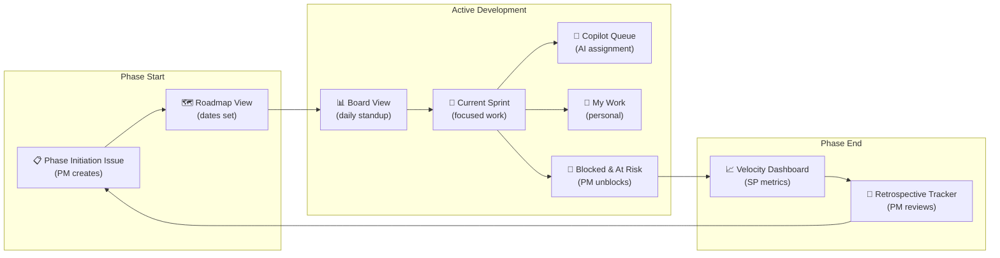

# GitHub Project — Setup & Views Guide

> **Purpose:** Step-by-step guide for creating a GitHub Project (V2), configuring custom fields, and setting up role-based views that ensure nothing falls through the cracks. This guide supplements the [AgentGitOps Instructions](agentgitops-instructions.md).

---

## Table of Contents

1. [Project Creation](#project-creation)
2. [Custom Fields](#custom-fields)
3. [Milestone & Roadmap Configuration](#milestone--roadmap-configuration)
4. [Story Point Capacity Model](#story-point-capacity-model)
5. [Required Views](#required-views)
6. [Role-Based View Matrix](#role-based-view-matrix)
7. [Organization Scaling Guide](#organization-scaling-guide)
8. [Fields Surfaced in Every View](#fields-surfaced-in-every-view)
9. [View Setup Instructions](#view-setup-instructions)

---

## Project Creation

### Prerequisites

```bash
# Authenticate with project scope (not available in Codespace GITHUB_TOKEN)
gh auth login --scopes "project,repo,read:org"

# Verify permissions
./bootstrap/check-prerequisites.sh
```

### Automated Setup

```bash
# Create project, add custom fields, add all open issues
./bootstrap/setup-github-project.sh [owner]
```

**What the script does:**
1. Creates a GitHub Project (V2) titled with your project name
2. Adds custom single-select fields: Phase, Priority, Size, Copilot Suitable
3. Adds custom date fields: Start Date, End Date (for Roadmap timeline)
4. Adds custom number field: Story Points (for velocity tracking)
5. Adds all open issues to the project

### Manual Setup (if script is unavailable)

1. Go to your profile/org → Projects → New Project
2. Select "Table" layout
3. Name the project (e.g., "My Project — Backlog")
4. Add custom fields (see [Custom Fields](#custom-fields) below)

---

## Custom Fields

These fields are created by `bootstrap/setup-github-project.sh` and are **required** for all views to function correctly.

| Field | Type | Options | Purpose |
|---|---|---|---|
| **Phase** | Single Select | Phase 0 – Phase N (one per milestone) | Roadmap grouping, phase filtering |
| **Priority** | Single Select | P1 – Critical, P2 – High, P3 – Medium, P4 – Low | Triage and sort |
| **Size** | Single Select | S (half-day), M (1–2 days), L (3–5 days), XL (1 week+) | Capacity planning, velocity |
| **Copilot Suitable** | Single Select | Yes, Partial, No | AI assignment queue |
| **Start Date** | Date | — | Roadmap timeline (set on phase initiation issues) |
| **End Date** | Date | — | Roadmap timeline (set on phase initiation issues) |
| **Story Points** | Number | — | Velocity tracking (auto-derived from Size: S=1, M=3, L=8, XL=13) |

> **Required in every view:** Assignees, Copilot Suitable, Phase, Priority, Size, Status.

### Field ID Configuration

After creating the project, capture field and option IDs so that `bootstrap/create-backlog-issues.sh` can set project fields on new issues. The script expects `bootstrap/project-fields.json` in this format:

```json
{
  "projectFields": {
    "phaseFieldId":    "PVTSSF_...",
    "priorityFieldId": "PVTSSF_...",
    "sizeFieldId":     "PVTSSF_...",
    "copilotFieldId":  "PVTSSF_..."
  },
  "options": {
    "phase": { "0": "<option-id>", "1": "<option-id>", ... },
    "priority": { "P1": "<option-id>", "P2": "<option-id>", "P3": "<option-id>", "P4": "<option-id>" },
    "size": { "S": "<option-id>", "M": "<option-id>", "L": "<option-id>", "XL": "<option-id>" },
    "copilot": { "Yes": "<option-id>", "Partial": "<option-id>", "No": "<option-id>" }
  }
}
```

**To generate `project-fields.json`:**

1. List all project fields (get field IDs and single-select option IDs):
   ```bash
   gh project field-list <PROJECT_NUMBER> --owner <OWNER> --format json > /tmp/fields.json
   ```

2. Extract field IDs:
   ```bash
   python3 -c "
   import json, sys
   data = json.load(open('/tmp/fields.json'))
   for f in data['fields']:
       print(f'{f[\"id\"]:40s} {f[\"name\"]}')
       if 'options' in f:
           for opt in f['options']:
               print(f'  {opt[\"id\"]:38s} {opt[\"name\"]}')
   "
   ```

3. Map the printed IDs into `bootstrap/project-fields.json` using the schema above. The `options` object maps short keys (`0`, `P1`, `S`, `Yes`, etc.) to the GitHub-generated option IDs.

See `bootstrap/project-fields.json` for a working example.

---

## Milestone & Roadmap Configuration

### Milestone Setup

Each phase maps 1:1 to a GitHub Milestone. Milestones provide:
- **Date boundaries** for retrospective metrics collection
- **Roadmap timeline** when used with Start/End Date fields
- **Phase grouping** for issue organization

```bash
# Create milestones (idempotent)
./bootstrap/setup-github-milestones.sh [owner/repo]
```

### Setting Milestone Due Dates

After creating milestones, set due dates to enable the Roadmap view:

```bash
# Set due date on a milestone
gh api -X PATCH "repos/{owner}/{repo}/milestones/{number}" \
  -f due_on="2025-07-15T00:00:00Z"
```

### Roadmap View Timeline

For the Roadmap view to display correctly:

1. **Phase Initiation issues** must have Start Date and End Date fields set
2. **Milestones** should have due dates matching the phase end date
3. **Phase Initiation issues** drive the timeline — one per phase, spanning the full phase duration

| Phase | Milestone | Initiation Issue | Retrospective Issue |
|---|---|---|---|
| Phase 0 | Phase 0 - Assessment | `[Phase 0] Phase Initiation — Assessment` | `[Phase 0] Retrospective` |
| Phase 1 | Phase 1 - Fix Function App | `[Phase 1] Phase Initiation — Fix Function App` | `[Phase 1] Retrospective` |
| ... | ... | ... | ... |

---

## Story Point Capacity Model

AgentGitOps uses a standardized story point system for velocity measurement and capacity planning.

### T-Shirt to Story Point Mapping

| Size | Story Points | Hours | Calendar Days | Description |
|---|---|---|---|---|
| **S** (half-day) | **1 SP** | 2.5 hours | < 1 day | Small, well-defined task |
| **M** (1–2 days) | **3 SP** | 7.5 hours | 1–2 days | Medium complexity, may span files |
| **L** (3–5 days) | **8 SP** | 20 hours | 3–5 days | Large task, multiple components |
| **XL** (1 week+) | **13 SP** | 32.5+ hours | 5+ days | Consider breaking down |

### Capacity Constants

| Constant | Value | Notes |
|---|---|---|
| 1 Story Point | 2.5 hours | Base unit of effort |
| Developer capacity/day | 3 SP (7.5 hours) | Accounts for meetings, context switching |
| Working days/week | 5 days | Standard work week |
| Developer capacity/week | 15 SP | 3 SP × 5 days |
| Sprint (2 weeks) | 30 SP/developer | Planning ceiling per developer |

### Phase Capacity Planning

```
Phase Capacity = Team Size × 3 SP/day × Working Days in Phase

Example: 1 developer, 2-week phase
  = 1 × 3 × 10 = 30 SP planned capacity
```

### AI Velocity Measurement

The retrospective calculates:
- **Total SP delivered** = Sum of story points on closed issues
- **AI-delivered SP** = SP on issues labeled `Copilot: Yes` that were closed
- **Human-delivered SP** = Total SP − AI-delivered SP
- **AI velocity ratio** = AI-delivered SP ÷ Total SP delivered
- **Velocity (SP/day)** = Total SP delivered ÷ Phase duration in working days

---

## Required Views

### Complete View Set

Every project should have **at minimum** these views to ensure full coverage:

| # | View Name | Type | Purpose | Primary Audience |
|---|---|---|---|---|
| 1 | **Board** | Board | Kanban workflow — see all work in progress | All roles |
| 2 | **Roadmap** | Roadmap | Phase timeline with milestones | PM, Business Driver |
| 3 | **Current Sprint** | Table | Active phase work only — what's happening now | Technologist, AI Copilot |
| 4 | **Copilot Queue** | Table | AI-assignable work queue | AI Copilot, Technologist |
| 5 | **Phase Overview** | Table | All issues grouped by phase | PM |
| 6 | **Priority Triage** | Table | Issues sorted by priority for triage | PM, Technologist |
| 7 | **My Work** | Table | Filtered to current user's assignments | All roles |
| 8 | **Blocked & At Risk** | Table | Issues labeled blocked or overdue | PM |
| 9 | **Velocity Dashboard** | Table | Story point tracking by phase | PM |
| 10 | **Retrospective Tracker** | Table | Phase initiation + retrospective issues | PM |

### "Nothing Falls Through the Cracks" Coverage

| Concern | Covered By View(s) |
|---|---|
| Unassigned work | Board (Backlog column), Phase Overview |
| Blocked items | Blocked & At Risk |
| AI work not being picked up | Copilot Queue |
| Phase behind schedule | Roadmap, Velocity Dashboard |
| Missing retrospectives | Retrospective Tracker |
| Work without size estimates | Priority Triage (sort by Size = blank) |
| Stale issues (no recent update) | Board (look for items not moving) |

---

## Role-Based View Matrix

### Which views matter for each role

| View | PM | Technologist | AI Copilot | Business Driver |
|---|---|---|---|---|
| **Board** | ✅ Daily | ✅ Daily | — | ✅ Weekly |
| **Roadmap** | ✅ Weekly | ⚪ Reference | — | ✅ Weekly |
| **Current Sprint** | ✅ Daily | ✅ Daily | ✅ Primary | ⚪ Reference |
| **Copilot Queue** | ⚪ Monitor | ✅ Assign from | ✅ Primary | — |
| **Phase Overview** | ✅ Planning | ⚪ Reference | — | ⚪ Reference |
| **Priority Triage** | ✅ Triage | ✅ Pick work | — | — |
| **My Work** | ✅ Daily | ✅ Daily | — | ✅ Daily |
| **Blocked & At Risk** | ✅ Daily | ✅ Daily | — | ✅ Escalation |
| **Velocity Dashboard** | ✅ Retro | ⚪ Reference | — | ✅ Retro |
| **Retrospective Tracker** | ✅ Phase boundary | — | — | ✅ Phase boundary |

✅ = Primary use | ⚪ = Occasional reference | — = Not applicable

---

## Organization Scaling Guide

### Small Team (1–3 people, solo dev + PM hat)

**Minimum views (5):**
1. Board — daily workflow
2. Current Sprint — focused work
3. Copilot Queue — AI delegation
4. Priority Triage — what to work on next
5. Roadmap — phase timeline

**Notes:** One person often fills PM + Technologist roles. Board view is the primary daily driver.

### Medium Team (4–10 people, dedicated PM)

**Standard views (8):**
All small team views plus:
6. Phase Overview — PM tracks cross-phase
7. My Work — individual focus
8. Blocked & At Risk — PM unblocks

**Notes:** Dedicated PM manages Board + Roadmap. Technologists use Current Sprint + My Work.

### Large Team / Enterprise (10+ people, multiple PMs, org-level)

**Full views (10+):**
All standard views plus:
9. Velocity Dashboard — sprint metrics
10. Retrospective Tracker — phase governance

**Additional recommended views:**
- **By Area** — Group by domain area label (infrastructure, backend, frontend, etc.)
- **By Assignee** — See workload distribution
- **Dependency Map** — Filter by issues with depends_on references
- **Release Readiness** — Filter: current phase + P1/P2 + not Done

**Notes:** Enterprise teams may run multiple projects. Use the org-level project to aggregate across repos. Business Drivers use Roadmap + Retrospective Tracker for governance.

---

## Fields Surfaced in Every View

The following fields **must** be visible as columns in every view to maintain consistency:

| Field | Why Always Visible |
|---|---|
| **Title** | Identify the issue |
| **Assignees** | Who is responsible |
| **Status** | Current workflow state |
| **Copilot Suitable** | Quick visual: is this AI-assignable? |
| **Phase** | Which phase this belongs to |
| **Priority** | Triage at a glance |
| **Size** | Effort estimate + story points |

### Additional fields per view type

| View | Extra Fields |
|---|---|
| Roadmap | Start Date, End Date, Milestone |
| Velocity Dashboard | Size (for SP calculation), Phase |
| Current Sprint | Labels (for type identification) |
| Retrospective Tracker | Milestone, Labels |

---

## View Setup Instructions

### View 1: Board

1. Click "+" to add a new view → Select "Board"
2. Group by: **Status** field
3. Columns: Backlog → Ready → In Progress → Done
4. Add all required fields as visible columns
5. Sort: Priority (ascending)

### View 2: Roadmap

1. Click "+" → Select "Roadmap"
2. Date field: **Start Date** (start) and **End Date** (end)
3. Group by: **Phase**
4. Zoom level: Monthly
5. Ensure Phase Initiation issues span each phase's date range
6. Set milestone due dates to align with phase end dates

### View 3: Current Sprint

1. Click "+" → Select "Table"
2. Filter: `Phase = [current phase]` AND `Status != Done`
3. Sort: Priority (ascending), then Size (descending)
4. Group by: Status
5. This view should show only active work

### View 4: Copilot Queue

1. Click "+" → Select "Table"
2. Filter: `Copilot Suitable = Yes` AND `Status != Done`
3. Sort: Phase (ascending), then Priority (ascending)
4. This is the primary view for AI Copilot issue assignment

### View 5: Phase Overview

1. Click "+" → Select "Table"
2. Group by: **Phase**
3. Sort: Priority (ascending)
4. No filters — shows everything
5. Useful for PM cross-phase planning

### View 6: Priority Triage

1. Click "+" → Select "Table"
2. Sort: Priority (ascending), then Phase (ascending)
3. No group by
4. Filter: `Status != Done`
5. PM uses this to re-prioritize and assign

### View 7: My Work

1. Click "+" → Select "Table"
2. Filter: `Assignees = @me`
3. Sort: Priority (ascending)
4. Group by: Status
5. Personal daily view for any role

### View 8: Blocked & At Risk

1. Click "+" → Select "Table"
2. Filter: `Labels contains blocked`
3. Sort: Priority (ascending)
4. PM reviews daily to unblock or escalate

### View 9: Velocity Dashboard

1. Click "+" → Select "Table"
2. Group by: **Phase**
3. Sort: Size (descending)
4. Show fields: Title, Size, Copilot Suitable, Status, Assignees
5. PM uses at retrospective to calculate SP delivered vs planned

### View 10: Retrospective Tracker

1. Click "+" → Select "Table"
2. Filter: `Labels contains type: phase-initiation OR Labels contains type: phase-retrospective`
3. Sort: Phase (ascending)
4. Shows paired initiation + retrospective issues per phase
5. PM uses at phase boundaries for governance

---

## Workflow Diagram — Views by Phase Lifecycle



---

## Reference

- [AgentGitOps Instructions](agentgitops-instructions.md) — Full workflow guide
- [Label Taxonomy](agentgitops-instructions.md#label-taxonomy) — Complete label reference
- `bootstrap/setup-github-project.sh` — Automated project creation
- `bootstrap/setup-github-labels.sh` — Label creation/update
- `bootstrap/setup-github-milestones.sh` — Milestone creation
- `bootstrap/project-fields.json` — Project V2 field/option ID configuration
