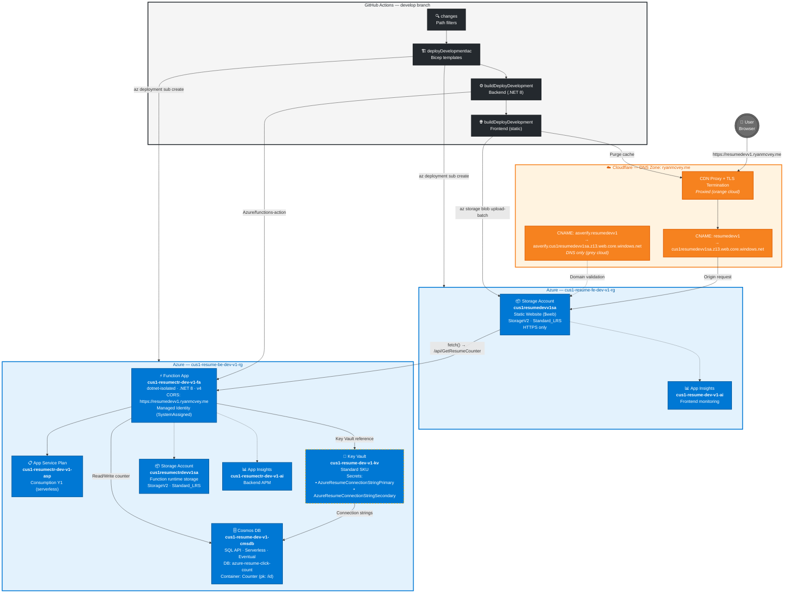

# Development Environment Architecture Diagram

Visual reference for the `dev` (v1) stack deployed via the `develop` branch. Resource names are derived from the [`dev-full-stack-cloudflare.yml`](../.github/workflows/dev-full-stack-cloudflare.yml) workflow.

> **Companion doc:** See [ARCHITECTURE.md — Development Resource Inventory](ARCHITECTURE.md#development-resource-inventory-v1) for the full tabular inventory.

## Legend

| Color | Provider | Hex |
|---|---|---|
| 🟠 Orange nodes / border | Cloudflare | `#F6821F` (fill), `#E05D00` (stroke) |
| 🔵 Blue nodes / border | Microsoft Azure | `#0078D4` (fill), `#005A9E` (stroke) |
| ⚫ Dark nodes | GitHub Actions | `#24292E` (fill) |
| 🔑 Dashed border (blue/gold) | Key Vault (secrets) | `#0078D4` fill, `#FFB900` stroke |

## Notes

- **Solid arrows** represent runtime data flow (user requests, API calls, secret lookups).
- **Dashed arrows** represent telemetry/monitoring or validation flows.
- **CI/CD arrows** show the deployment pipeline from GitHub Actions to Azure and Cloudflare.
- The Cloudflare CDN proxy also terminates TLS — the user never hits the Azure Storage endpoint directly.
- The `asverify` CNAME is DNS-only (grey cloud) and used solely for Azure custom domain validation.
- Cosmos DB connection strings are stored in Key Vault and referenced by the Function App via `@Microsoft.KeyVault(...)` app setting syntax.
